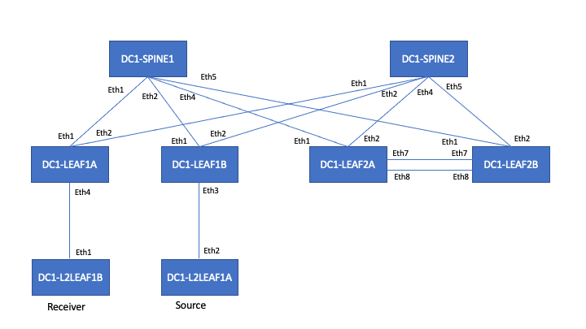

This repository has multicast configuration files and show commands for EOS devices. 



EVPN-VXLAN:
- Symmetric IRB
- Underlay: OSPFv2
- Overlay: iBGP (Lo0)
- VXLAN: Lo1

2 spines:
- DC1-SPINE1: RP 192.168.253.1
- DC1-SPINE2: RP 192.168.253.1

4 leaves:
- DC1-LEAF1A: L3 LEAF. no MLAG. Anycast RP 192.168.253.1. Connect the multicast receiver.
- DC1-LEAF1B: L3 LEAF. no MLAG. Anycast RP 192.168.253.1. Connect the multicast receiver.
- DC1-LEAF2A: L3 LEAF. MLAG. Anycast RP 192.168.253.1
- DC1-LEAF2B: L3 LEAF. MLAG. Anycast RP 192.168.253.1

2 hosts:
- The device DC1-L2LEAF1A is a multicast source
- The device DC1-L2LEAF1B is a multicast receiver

Multicast:
- PIM sparse mode
- Anycast RP
- RP is 192.168.253.1
- 192.168.253.1 is Lo2 of:
  - DC1-LEAF1A
  - DC1-LEAF1B
  - DC1-LEAF2A
  - DC1-LEAF2B
- Communication between RP is using Lo0 (192.168.255.X)

DC1-L2LEAF1A is an host connected to DC1-LEAF1B on VLAN 100. It is the multicast source (iperf from bash)
```
DC1-L2LEAF1A#sh lldp neighbors

Port          Neighbor Device ID            Neighbor Port ID    TTL
---------- ----------------------------- ---------------------- ---
Et2           DC1-LEAF1B.arista.com         Ethernet3           120
```
```
interface Ethernet2
   description DC1-LEAF1B_Ethernet3
   no switchport
   ip address 10.100.100.2/24
```
```
ip route 0.0.0.0/0 10.100.100.1
```
DC1-LEAF1B
```
interface Ethernet3
   description DC1-L2LEAF1A_Ethernet2
   switchport access vlan 100
```
```
interface Vlan100
   ip address 10.100.100.1/24
   ip ospf area 0.0.0.0
   pim ipv4 sparse-mode
```

DC1-L2LEAF2A is an host connectd to DC1-LEAF1A on VLAN 90. It is a multicast receiver (iperf from bash)
```
DC1-L2LEAF2A#sh lldp neighbors
Port          Neighbor Device ID            Neighbor Port ID    TTL
---------- ----------------------------- ---------------------- ---
Et1           DC1-LEAF1A.arista.com         Ethernet4           120
```
```
interface Ethernet1
   description DC1-LEAF1A_Ethernet4
   no switchport
   ip address 10.90.90.2/24
```
```
ip route 0.0.0.0/0 10.90.90.1
```
DC1-LEAF1A
```
interface Ethernet4
   description DC1-L2LEAF2A_Ethernet1
   switchport access vlan 90
```
```
interface Vlan90
   ip address 10.90.90.1/24
   ip ospf area 0.0.0.0
   pim ipv4 sparse-mode
```

Receiver: iperf on DC1-L2LEAF2A
```
[arista@DC1-L2LEAF2A ~]$ iperf -s -u -B 226.200.200.200 -i 1 -p 51000
------------------------------------------------------------
Server listening on UDP port 51000
Binding to local address 226.200.200.200
Joining multicast group  226.200.200.200
Receiving 1470 byte datagrams
UDP buffer size:  208 KByte (default)
------------------------------------------------------------
[  3] local 226.200.200.200 port 51000 connected with 10.100.100.2 port 33222
[ ID] Interval       Transfer     Bandwidth        Jitter   Lost/Total Datagrams
[  3]  0.0- 1.0 sec  90.4 KBytes   741 Kbits/sec   5.182 ms   31/   94 (33%)
[  3]  1.0- 2.0 sec  96.2 KBytes   788 Kbits/sec  15.025 ms    0/   67 (0%)
[  3]  2.0- 3.0 sec  66.0 KBytes   541 Kbits/sec  15.521 ms    0/   46 (0%)
[  3]  3.0- 4.0 sec  64.6 KBytes   529 Kbits/sec  20.876 ms    0/   45 (0%)
[  3]  4.0- 5.0 sec  50.2 KBytes   412 Kbits/sec  24.655 ms   39/   74 (53%)
[  3]  5.0- 6.0 sec   185 KBytes  1.52 Mbits/sec   4.153 ms   84/  213 (39%)
[  3]  6.0- 7.0 sec   128 KBytes  1.05 Mbits/sec   1.948 ms    0/   89 (0%)
[  3]  7.0- 8.0 sec   128 KBytes  1.05 Mbits/sec   3.252 ms    0/   89 (0%)
[  3]  8.0- 9.0 sec   129 KBytes  1.06 Mbits/sec   2.574 ms    0/   90 (0%)
[  3]  0.0- 9.9 sec  1.03 MBytes   871 Kbits/sec   2.835 ms  154/  891 (17%)
```

Source: iperf on DC1-L2LEAF1A
```
[ansible@DC1-L2LEAF1A ~]$ iperf -c 226.200.200.200 -u -T 32 -i 1 -p 51000
------------------------------------------------------------
Client connecting to 226.200.200.200, UDP port 51000
Sending 1470 byte datagrams
Setting multicast TTL to 32
UDP buffer size:  208 KByte (default)
------------------------------------------------------------
[  3] local 10.100.100.2 port 33222 connected with 226.200.200.200 port 51000
[ ID] Interval       Transfer     Bandwidth
[  3]  0.0- 1.0 sec   128 KBytes  1.05 Mbits/sec
[  3]  1.0- 2.0 sec   129 KBytes  1.06 Mbits/sec
[  3]  2.0- 3.0 sec   123 KBytes  1.01 Mbits/sec
[  3]  3.0- 4.0 sec   129 KBytes  1.06 Mbits/sec
[  3]  4.0- 5.0 sec   129 KBytes  1.06 Mbits/sec
[  3]  5.0- 6.0 sec   128 KBytes  1.05 Mbits/sec
[  3]  6.0- 7.0 sec   128 KBytes  1.05 Mbits/sec
[  3]  7.0- 8.0 sec   128 KBytes  1.05 Mbits/sec
[  3]  8.0- 9.0 sec   128 KBytes  1.05 Mbits/sec
[  3]  9.0-10.0 sec   128 KBytes  1.05 Mbits/sec
[  3]  0.0-10.0 sec  1.25 MBytes  1.05 Mbits/sec
[  3] Sent 891 datagrams
[ansible@DC1-L2LEAF1A ~]$
 ```

```
DC1-SPINE2#tcpdump interface ethernet 1
...
14:29:06.300319 50:14:00:34:23:6a > 01:00:5e:48:c8:c8, ethertype IPv4 (0x0800), length 1512: 10.100.100.2.41028 > 226.200.200.200.51000: UDP, length 1470
14:29:06.312691 50:14:00:34:23:6a > 01:00:5e:48:c8:c8, ethertype IPv4 (0x0800), length 1512: 10.100.100.2.41028 > 226.200.200.200.51000: UDP, length 1470
14:29:06.323442 50:14:00:34:23:6a > 01:00:5e:48:c8:c8, ethertype IPv4 (0x0800), length 1512: 10.100.100.2.41028 > 226.200.200.200.51000: UDP, length 1470
14:29:06.333831 50:14:00:34:23:6a > 01:00:5e:48:c8:c8, ethertype IPv4 (0x0800), length 1512: 10.100.100.2.41028 > 226.200.200.200.51000: UDP, length 1470
14:29:06.345992 50:14:00:34:23:6a > 01:00:5e:48:c8:c8, ethertype IPv4 (0x0800), length 1512: 10.100.100.2.41028 > 226.200.200.200.51000: UDP, length 1470
14:29:06.357810 50:14:00:34:23:6a > 01:00:5e:48:c8:c8, ethertype IPv4 (0x0800), length 1512: 10.100.100.2.41028 > 226.200.200.200.51000: UDP, length 1470
14:29:06.368146 50:14:00:34:23:6a > 01:00:5e:48:c8:c8, ethertype IPv4 (0x0800), length 1512: 10.100.100.2.41028 > 226.200.200.200.51000: UDP, length 1470
14:29:06.379080 50:14:00:34:23:6a > 01:00:5e:48:c8:c8, ethertype IPv4 (0x0800), length 1512: 10.100.100.2.41028 > 226.200.200.200.51000: UDP, length 1470
14:29:06.391112 50:14:00:34:23:6a > 01:00:5e:48:c8:c8, ethertype IPv4 (0x0800), length 1512: 10.100.100.2.41028 > 226.200.200.200.51000: UDP, length 1470
14:29:06.401469 50:14:00:34:23:6a > 01:00:5e:48:c8:c8, ethertype IPv4 (0x0800), length 1512: 10.100.100.2.41028 > 226.200.200.200.51000: UDP, length 1470
14:29:06.412956 50:14:00:34:23:6a > 01:00:5e:48:c8:c8, ethertype IPv4 (0x0800), length 1512: 10.100.100.2.41028 > 226.200.200.200.51000: UDP, length 1470
14:29:06.426537 50:14:00:34:23:6a > 01:00:5e:48:c8:c8, ethertype IPv4 (0x0800), length 1512: 10.100.100.2.41028 > 226.200.200.200.51000: UDP, length 1470
14:29:06.438430 50:14:00:34:23:6a > 01:00:5e:48:c8:c8, ethertype IPv4 (0x0800), length 1512: 10.100.100.2.41028 > 226.200.200.200.51000: UDP, length 1470
14:29:06.445873 50:14:00:34:23:6a > 01:00:5e:48:c8:c8, ethertype IPv4 (0x0800), length 1512: 10.100.100.2.41028 > 226.200.200.200.51000: UDP, length 1470
14:29:06.459909 50:14:00:34:23:6a > 01:00:5e:48:c8:c8, ethertype IPv4 (0x0800), length 1512: 10.100.100.2.41028 > 226.200.200.200.51000: UDP, length 1470
...
```
```
DC1-SPINE2#sho interface ethernet 1 | grep multic
     Received 0 broadcasts, 11 multicast
     Sent 0 broadcasts, 904 multicast
DC1-SPINE2#
```
